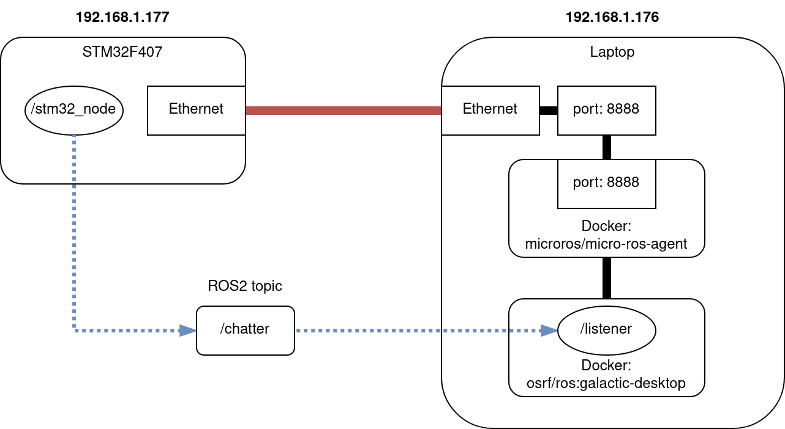

# micro_ros_stm32_template 

Boilerplate to create a project with:

**STM32 + Ethernet + micro-ROS + FreeRTOS + Arduino + PlatformIO**  

## Default config

STM32F407 + Ethernet (eg. STM32-E407 Olimex board) directly connected with Ethernet cable to a computer.

| device | IP:PORT |
| - | - |
| Client (STM32F407 + Ethernet) | `192.168.1.177` |
| Agent (user's laptop) | `192.168.1.108:8888` |

## Flashing STM32

Click **[Use this template](https://github.com/husarion/micro_ros_stm32_template/generate)** button, and clone your own copy of this repo.

Open the project with a [Visual Studio Code](https://code.visualstudio.com/) with [PlatformIO extension](https://platformio.org/install/ide?install=vscode).

```bash
# Build project
$ pio run

# Upload firmware
$ pio run --target upload

# Clean build files
$ pio run --target clean

```

### Serial

uncomment:

```
upload_protocol = serial
```

Set `BOOT0` pin to HIGH and click `RESET` button, to enter the programming mode.

Click **PlatformIO: Upload** button.

Set `BOOT0` pin to LOW and click `RESET` to start newly flashed firmware.

## Running a demo

System architecture:



Now to test Micro-ROS with a default ROS 2 listener/talker example just execute:

```bash
$ cd demo
$ docker-compose up

$ docker ps
CONTAINER ID   IMAGE                               COMMAND                  CREATED          STATUS          PORTS                                       NAMES
f2c457f245bf   osrf/ros:galactic-desktop           "/ros_entrypoint.sh …"   48 minutes ago   Up 17 seconds                                               agent_listener_1
bdabd7761b4c   microros/micro-ros-agent:galactic   "/bin/sh /micro-ros_…"   51 minutes ago   Up 17 seconds   0.0.0.0:8888->8888/udp, :::8888->8888/udp   agent_talker_1

$ docker exec -it bda bash

root@f2c457f245bf:/# source /opt/ros/$ROS_DISTRO/setup.bash
root@f2c457f245bf:/# ros2 node list
/listener
/stm32_node
root@f2c457f245bf:/# ros2 node info /stm32_node 
/stm32_node
  Subscribers:

  Publishers:
    /chatter: std_msgs/msg/String
  Service Servers:

  Service Clients:

  Action Servers:

  Action Clients:

root@f2c457f245bf:/# ros2 topic echo /chatter 
data: 'Hello World: 6, sys_clk: 9000'
---
data: 'Hello World: 7, sys_clk: 9000'
---
data: 'Hello World: 8, sys_clk: 9000'
---
data: 'Hello World: 9, sys_clk: 9000'
---
```

---

## Troubleshooting

> [STM32Ethernet](https://github.com/stm32duino/STM32Ethernet/issues/23)

### Static IP on Ubuntu

Please set a static IP address on your laptop, eg. with netplan:

```yaml
network:
  version: 2
  renderer: networkd
  ethernets:
    enp7s0:
      dhcp4: no
      dhcp6: no
      addresses:           
        - 192.168.1.176/24
```